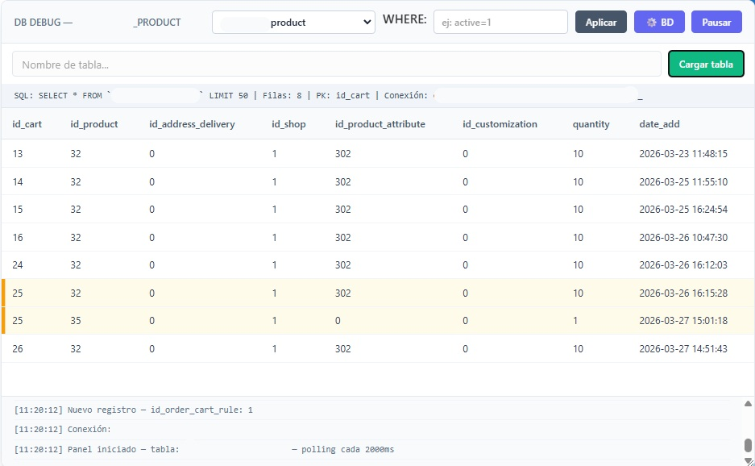

# DB Debug Panel

Panel de depuración en tiempo real para bases de datos, inyectable en cualquier entorno web y totalmente dinámico.

## ✨ Características

- Monitorización en vivo de cualquier tabla
- Renderizado automático de columnas (sin configuración adicional)
- Detección de cambios y nuevos registros
- Filtros dinámicos (`WHERE`)
- Ordenación por columnas
- Interfaz arrastrable y redimensionable
- Soporte para múltiples tablas desde la consola
- Diseño limpio, claro y profesional

## ⚙️ Configuración

Edita el objeto `CONFIG` dentro del script:

```js
const CONFIG = {
    endpoint : '/_debug/db-debug.php',
    table    : 'mi_tabla',
    cols     : '',
    order    : '',
    dir      : 'DESC',
    limit    : 50,
    interval : 2000,
    idCol    : 'id',
};
```

## 🚀 Uso

1. Incluye el script en tu entorno de desarrollo
2. Asegúrate de tener disponible el endpoint `db-debug.php`
3. Abre cualquier página → el panel aparecerá automáticamente

## 🧠 Uso avanzado

Desde la consola del navegador:

```js
DbDebugPanel.addTable('ps_orders');
DbDebugPanel.setTable('ps_customer');
DbDebugPanel.config.interval = 5000;
```

## 📊 Qué muestra

- Filas en tiempo real
- Cambios entre actualizaciones
- Registros nuevos resaltados
- Información SQL y metadatos

## 🎯 Ideal para

- Debugging rápido sin herramientas externas
- Monitorización de tablas en desarrollo
- Inspección de datos en tiempo real

## 📄 Licencia

Uso libre para desarrollo y proyectos internos.
